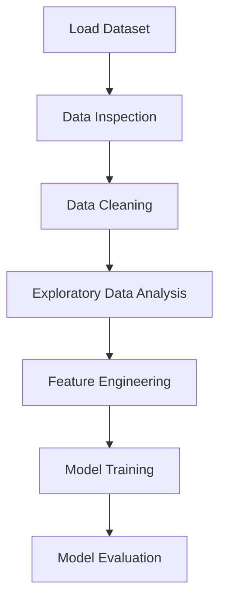

# 📈  Tesla Stock Price Prediction Project


This project focuses on **predicting stock prices using Machine Learning techniques**.
The goal is to analyze historical stock market data and build a model that can **predict future stock price trends**.

This project demonstrates a **complete data science and machine learning pipeline**, including data preprocessing, exploratory data analysis, model training, and evaluation.

---

# 📌 Project Overview

Stock markets generate massive amounts of financial data every day. Analyzing this data manually is difficult and time-consuming.

Using **Machine Learning and Data Analysis techniques**, we can analyze historical stock prices and build models that help predict **future price movements**.

In this project, we perform:

* Data inspection
* Data cleaning
* Exploratory Data Analysis (EDA)
* Feature preparation
* Machine Learning model training
* Model evaluation

The objective is to **build a predictive model that analyzes historical stock data to forecast future prices**.

---

# 🧠 Machine Learning Workflow



---

# ⚙️ Technologies Used

* Python
* Pandas
* NumPy
* Matplotlib
* Seaborn
* Scikit-Learn
* Jupyter Notebook

---

# 📊 Key Analysis Performed

The project includes several important steps for stock data analysis.

---

### 1️⃣ Data Inspection

* Checking dataset structure
* Viewing dataset shape
* Understanding stock market features
* Identifying missing values

---

### 2️⃣ Data Cleaning

* Handling missing values
* Preparing stock price data
* Formatting dataset for analysis

---

### 3️⃣ Exploratory Data Analysis (EDA)

EDA helps understand stock price behavior and patterns.

Analysis performed:

* Stock price trends over time
* Distribution of stock prices
* Relationship between different variables
* Detection of anomalies and outliers

---

### 4️⃣ Data Visualization

Different plots are used to analyze stock price behavior:

* Line Plot for price trends
* Histogram for price distribution
* Correlation Heatmap
* Distribution plots

Libraries used:

* Matplotlib
* Seaborn

---

### 5️⃣ Model Training

The dataset is divided into:

* Training data
* Testing data

A Machine Learning model is trained using **Scikit-Learn** to predict stock prices based on historical data.

---

### 6️⃣ Model Evaluation

The trained model is evaluated to determine how accurately it predicts stock price movements.

---

# 📈 Insights Generated

The analysis helps uncover:

* Historical price trends
* Market volatility patterns
* Relationships between stock variables
* Key factors affecting stock price movement

These insights help understand **financial market behavior and prediction possibilities**.

---

# 📂 Project Structure

```
Stock-Price-Prediction
│
├── Stock_price_prediction.ipynb
├── Tesla.csv
├── requirements.txt
└── README.md
```

---

# 🚀 How to Run the Project

### 1️⃣ Clone the Repository

```bash
git clone https://github.com/your-username/stock-price-prediction.git
```

---

### 2️⃣ Navigate to the Project Folder

```bash
cd stock-price-prediction
```

---

### 3️⃣ Install Required Libraries

```bash
pip install -r requirements.txt
```

---

### 4️⃣ Run the Notebook

Open **Jupyter Notebook** and run all cells in:

```
Stock_price_prediction.ipynb
```

---

# 🎯 Skills Demonstrated

* Exploratory Data Analysis
* Data Cleaning
* Financial Data Analysis
* Machine Learning
* Data Vis
